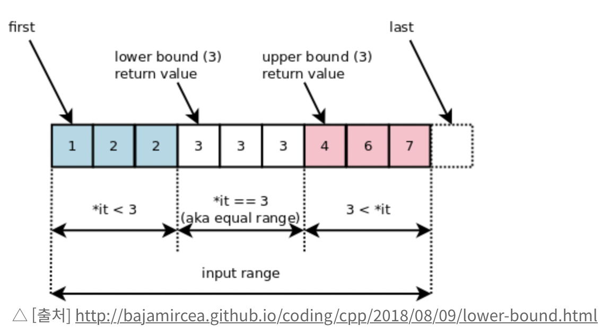
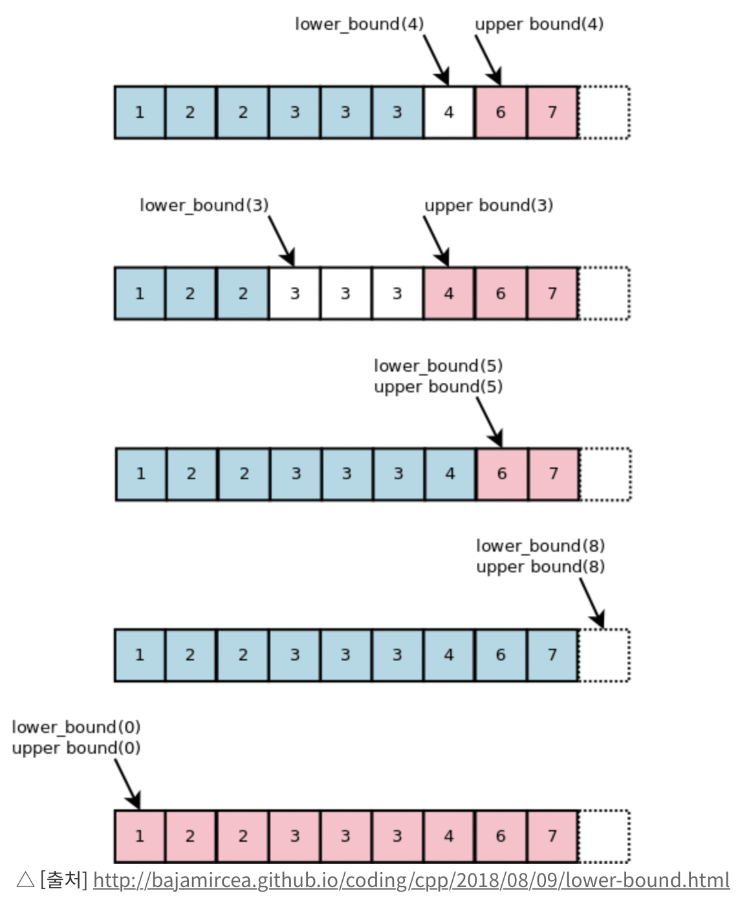

## Binary search

```python
def binary_search(data, target) :
    low = 0
    high = len(data) - 1

    while low <= high :
        mid = (low + high)//2
        if data[mid] < target :
            low = mid + 1
        elif data[mid] > target :
            high = mid - 1
        else :
            return mid

    print('{} not in data'.format(target))

```

이분 탐색 : 정렬된 데이터를 반으로 나누어서 target을 찾는 방법

> 주어진 정렬된 data 의 mid 인덱스가 찾고자 하는 target값 보다 작으면
>
> mid + 1 인덱스를 low 로 두어 **오른쪽 절반 에서 탐색을 다시한다**
>
> ex) target = 6
>
> data = [1, 3, 4, **5**, 6, 7, 9]
>
> [6, 7, 9] 에서 탐색 ㄱ

## Binary search 의 lower bound, upper bound

- 주어진 자료에서 중복되지 않은 값이 주어질 때 
  - 이분 탐색 하면 해당 인덱스 정확히 찾아냄

- 정렬된 자료 내 중복값 있을 때
  - lower bound
    - 데이터 내 특정 K값보다 같거나 큰값이 처음 나오는 위치를 리턴
  - upper bound
    - K값보다 처음으로 큰 값이 나오는 위치를 리턴



> 따라서 lower bound, upper bound를 이용하여 데이터 내 중복값이 몇 개인지도 알 수 있다.

### 이해를 돕기 위한 더 많은 그림...



### 혼자 구현 해보려면 은근 헷갈려

- 생각해야 할 부분 : 위 사진에서 0, 8은 data에 없지만 return 값이 존재하도록 해야한다.

### lower bound

```python
def lower_bound(data, target) :
    low = 0
    high = len(data)
    while low < high :
        mid = (low + high) // 2
        if target <= data[mid] :
            high = mid
        else :
            low = mid + 1
    return low
```

### 이분 탐색과 다른 점 : 

1. high 를 len(data)로 두어서 데이터의 최대 값을 넘어가는 타겟이 들어와도 인덱스를 반환해준다.
2. high = mid - 1 이 아니고 high = mid 로 두어서 중복값이 있을 경우 가장 왼쪽 값을 찾을 수 있게 한다.


### upper bound

```python
def upper_bound(data, target) :
    low = 0
    high = len(data)
    while low < high :
        mid = (low + high) // 2
        if target >= data[mid] :
            low = mid + 1
        else :
            high = mid
    return low
```


## 헷갈릴 때

[1, 2, 3, 3, 3, 4, 7] 대충 중복있는 배열 하나 두고 (target = 3)

target = data[mid]

target > data[mid]

target < data[mid]

세가지 경우 모두 생각 해본다. 어떻게 진행해야할지