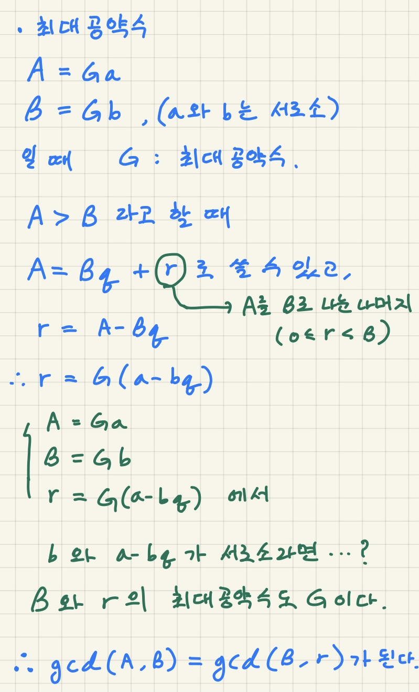

## 최대공약수와 최소공배수



b 와 a - bq 가 서로소인 것의 증명은 간단하다.

b 와 a - bq 가 서로소가 아니라고(공약수가 존재한다) 가정하면 모순이 쉽게 찾아진다.

실제 예를 들어보자

```python
gcd(18,12) = gcd(12,6) # 18 = 12*1 + 6
gcd(12,6) = gcd(6,0) # 12 = 6*2 + 0
```

- 여기서 나머지가 0 이 된다는 소리는,
- 12가 6으로 정확히 나누어 떨어진다는 뜻이며,
- **즉, 6이 바로 12와 6의 최대공약수가 된다.**


### 서로소의 최대공약수를 구할 때는 어떻게 되는지 살펴보자

```python
# 서로소 일 때
gcd(18,7) = gcd(7,4)
gcd(7,4) = gcd(4,3)
gcd(4,3) = gcd(3,1)
gcd(3,1) # 3 = 1*3 + 0
```

- 예상대로 1이 최대공약수가 된다.


### 최소공배수

- 최소공배수의 정의 : 두 수의 공통인 배수들 중 가장 작은 것
- 5와 7의 공배수 : 35, 70 ,105 등등..
- 12와 10의 공배수 : 60, 120, 180 등등..


- 초등학교 때 배운 최소공배수 구하는 법을 생각해보자.
  12 = 2x2x3
  10 = 2x5

  > 2x2x3x5 = 60 이렇게 구했었다.

  12와 10에 각각 어떤 숫자를 곱해서 같은 수가 되도록 만드는 것이다. 
  그러면 당연히 12에 10을 곱하고, 10에 12를 곱해서 120이 되도록하면 되는데,
  굳이 안곱해도 되는게 있다는 소리다. 그게 바로 최대공약수이다.

  > 12 = 2x2x3 에다가 2x5
  > 10 = 2x5 에다가 2x2x3
  > 을 곱하면 같아지긴 하는데, 2, 즉 최대공약수는 두 숫자에 모두 공통으로 들어있기 때문에 안곱해도 같아진다.
  >
  > 12 = 2x2x3 에다가 5
  > 10 = 2x5 에다가 2x3
  > 만 하자는 소리다.
  >
  > 그럼 60이 만들어진다!!!

  

- 12와 10의 최대공약수를 G 라고 하자,

- 그럼 12 = Ga, 10 = Gb 이다. (a와 b는 서로소)

- 120 = GGab 에서 G 로 한번 나눠주면 60 = Gab = lcm(12,10) 가 된다.

- 따라서 12와 10의 최소공배수는 60이다.

- **즉, A와 B의 최소공배수는 A*B를 gcd(A,B)로 한 번 나눠주면 된다.**


## 파이썬 코드

```python
def _gcd(a,b) :
    if b == 0 :
        return abs(a)
    return _gcd(b,a%b)

# 참고로 약수는 음수에 확장해서도 가능합니다. (일반적으로는 양의 약수만 다룸)
# 4의 약수 : {-4, -2, -1, 1, 2, 4}
# -4의 약수 : {-4, -2, -1, 1, 2, 4}
```

```python
def _lcm(a,b) :
    return int(a*b/_gcd(a,b))
```

-dnlxo