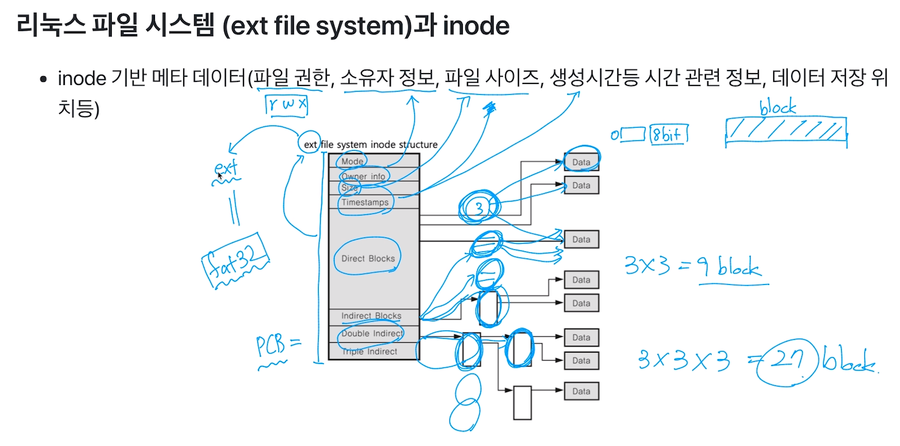

## 쉘 기본 정리2

## 리다이렉션과 파이프

## Standard Stream

- stdin, stout, stderr

## redirection

- 표준 스트림 흐름을 바꿔줄 수 있다. > , < 을 사용함 
- 주로 명령어 표준 출력을 화면이 아닌 파일에 쓸 때
- ls > files.txt

## 파이프

- 두 프로세스 사이에서 한 프로세스의 출력 스트림을 또다른 프로세스의 입력 스트림으로 사용할 때 사용 됨
- 파이프(pipe) 예 
- ls | grep file 
  - ‑ ls 명령을 통한 출력 내용이 grep 명령의 입력 스트림으로 들어감
  - grep file 는 grep 명령의 입력 스트림을 검색해서 file 이라는 문구가 들어 있는 입력 내용만 출력해줌 
  - 따라서, ls 명령으로 해당 디렉토리 또는 파일명에 file 이라는 문구가 있는지를 출력해줌

# 프로세스와 바이너리

- 코드 이미지 또는 바이너리: 실행파일 
- 실행 중인 프로그램: 프로세스 
  - 가상 메모리 및 물리 메모리 정보 
  - 시스템 리소스 관련 정보 
  - 스케쥴링 단위

## 리눅스는 다양한 프로세스 실행 환경 

- 리눅스는 기본적으로 다양한 프로세스가 실행됨 
- 유닉스 철학: 여러 프로그램이 서로 유기적으로 각자의 일을 수행하면서 전체 시스템이 동작하도록 하는 모델

## 리눅스와 파일 정리 

- open read write close
- 모든 것은 파일이라는 철학을 따름 
- 모든 인터렉션은 파일을 읽고, 쓰는 것처럼 이루어져있음 
- 마우스, 키보드와 같은 모든 디바이스 관련된 기술도 파일과 같이 다루어짐 
- **모든 자원에 대한 추상화 인터페이스로 파일 인터페이스를 활용**

# 쉘 명령어

- apt-get install
- jobs
- bg : 바로 직전에 멈춘 프로세스 실행 bg 2 << 2번 프로세스 다시실행
- control c 를 누르면 프로세스 작업이 취소되고 완전히 종료됨. jobs에 안남음
- ps [옵션] : 프로세스 상태 확인
- kill -9 [pid]
- cp : 파일 복사
- ls -i : 아이노드 값 확인
- ln A B : 하드 링크 (동일한 파일 inode 를 가리킴)
- 하드링크를 한 후 rm A 삭제 해도 B 파일 접근 가능
- 

> 하드 링크와 소프트 링크 하드 링크/소프트 링크 둘다 어느 하나 파일을 수정하면, 각 파일이름으로 동일한 내용 접근 가능

- 소프트(심볼릭) 링크: ln ‑s A B (inode 값 다름)
  - Windows OS의 바로가기와 동일 
  - ls ‑al 하면, 소프트 링크 확인 가능 
  - lrwxr-xr-x link3.txt -> link2.txt 
  - rm A 로 A를 삭제하면? B는 해당 파일 접근 불가

- 

## 특수 파일 

- 디바이스 
  - 블록 디바이스(Block Device) : HDD, CD/DVD와 같이 블록 또는 섹터 등 정해진 단위로 데이터 전송, IO 송수신 속도가 높음 
  - 캐릭터 디바이스(Character Device) : 키보드, 마우스등 byte 단위 데이터 전송, IO 송수신 속도가 낮음 
  - cd /dev, cat tty

## 정리 

- 파일 추상화 인터페이스를 활용 다양한 데이터/디바이스 접근 
- 파일 네임스페이스는 전역 네임스페이스 활용 (/media/floofy/dave.jpg) 
- '파일이름:inode'로 매칭, 파일 시스템은 inode 기반 접근 
- 하드 링크: 동일 inode 가리키는 파일 이름만 하나 더 만듬 
- 소프트 링크: 특정 파일 바로가기 파일을 만듬 
- ln 명령 알아두기 
- 특수 파일: 블록/캐릭터 디바이스

