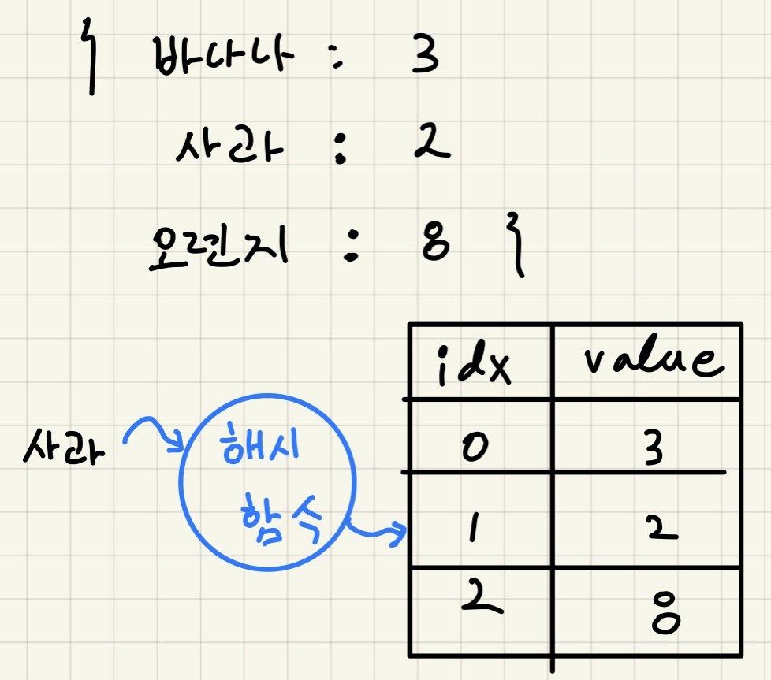
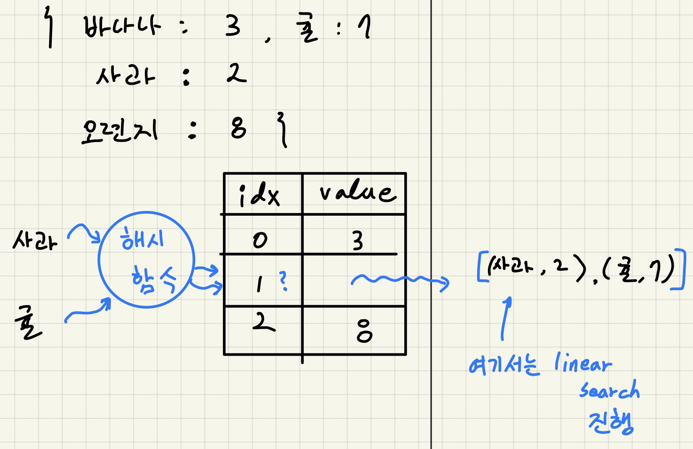

## ⚡️ Hash, Hash Table, Hash Map

---

### 해시 테이블

- { key : value } 시스템의 자료구조이다.
- ex) js에서는 object, python에서는 dictionary가 있다.
- 탐색 시 key로 접근하여 value값을 바로 찾을 수 있으므로 O(1)의 시간 복잡도를 가진다.
- key값이 **해시함수**를 통해 반환된 값을 **해시값(hash)**이라고 한다.
- 따라서 배열대신 해시테이블을 사용하는 것이 훨씬 빠른경우가 있다.
  - [ 'dnl', 'xo', 'dud' ] 에 'xo'이 있는지 확인하려면 배열을 전부 돌면서 확인해야 하지만 (O(N))
  - { 'dnl' : true, 'xo' : true, 'dud' : false } 에서는 'xo'의 값이 true인지만 확인하면 되므로 O(1)만에 알 수 있다.
- 해시테이블의 value들은 사실 배열구조에 담겨있지만, **해시함수**가 key값을 해당하는 value값이 위치한 인덱스 넘버로 바꿔준다.

- 하지만 **해시함수**는 일대일함수가 아니다! 즉, 다른 key값이지만 같은 idx넘버를 줄 수도 있다.
- 이것을 **해시충돌(Collision)**이라고 한다.
- 해결 방법은 여러가지가 있으며 그 중 하나는 배열 안에 또 배열을 만드는 방법이다.

- 따라서 worst case의 경우 해시테이블의 탐색도 O(N)이 소요될 수 있다.
- **해시함수**는 이미 똑똑한 사람들이 만들어놨다 ㅎㅎ.

---

### 해시 테이블의 장점

1. 적은 리소스로 많은 데이터를 효율적으로 관리할 수 있다.
   - 예) HDD, Cloud에 존재하는 많은 데이터들을 유한한 개의 해시(Hash)값으로 매핑하여 작은 크기의 캐쉬 메모리로 프로세스 관리가 가능하다.
2. 검색, 삽입, 삭제가 빠르다. (평균 시간복잡도 : O(1) 최악의 경우 O(N))
3. 키(key)와 해시값(Hash)이 연관성이 없어 보안에도 많이 사용된다.
4. 데이터 캐싱(Data Caching)에 많이 사용된다.
   - get(key), put(key)에 캐시 로직을 추가하면 자주 hit하는 데이터를 바로 찾을 수 있다.
5. 중복을 제거하는데 유용하다.

### 해시 테이블의 단점

1. 충돌
2. 공간 복잡도가 커진다.
3. 순서가 있는 배열에는 어울리지 않는다.
4. 해시 함수 의존도가 높아진다.

---

### 그럼 HashMap은 뭔데?

- 해시 테이블은 key에 Null 값을 허용하지 않는다.
- 해시 맵은 key에 Null 값을 허용한다.

---

### 출처

- https://hee96-story.tistory.com/48
- https://www.youtube.com/watch?v=HraOg7W3VAM